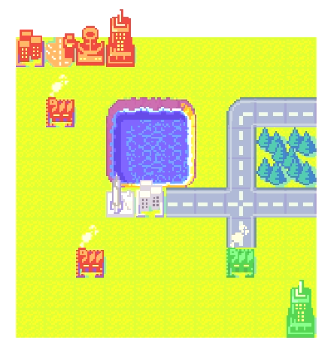

# AWO

Small fangame based on Advance Wars, written in C and using OpenGL. The end goal is to create a version playable in a web browser with multiplayer capabilities (through WebAssembly).

Still largely a work in progress. The completed functionalities include parts of the core engine, basic map rendering using OpenGL shaders supporting palettes, and basic editing.

The game date and sprite sheet used by the game are generated by my Go project, [awodatagen](https://github.com/turnabout/awodatagen).

## Directories

`AWO` is the game engine, meant to be compiled as a library and used through its minimal, public interface.

`AWO_Console` is an example executable making use of the AWO game engine library. It functions as a commandline application by using the PDCurses library. Entered commands can be processed to directly communicate with the AWO engine library (example: set the currently selected type of tile the user is currently editing with, update the game window's size, etc).

`AWO_Desktop` is the simplest example executable making use of the AWO game engine library. It only creates an instance of the game and runs it in its default game mode.

`AWO_Tests` are unit tests for the `AWO` core game engine library, using the Google Test library.

## Local setup (Linux)

**TODO**

